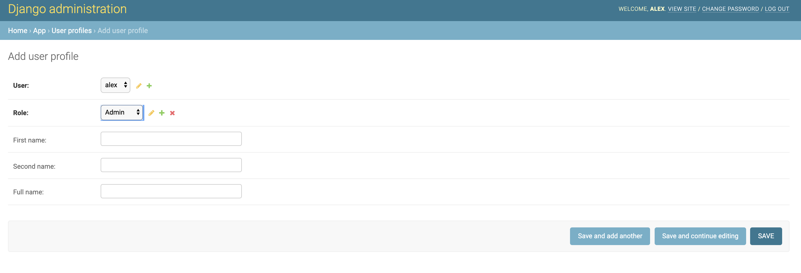
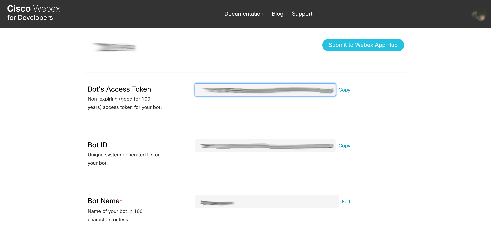
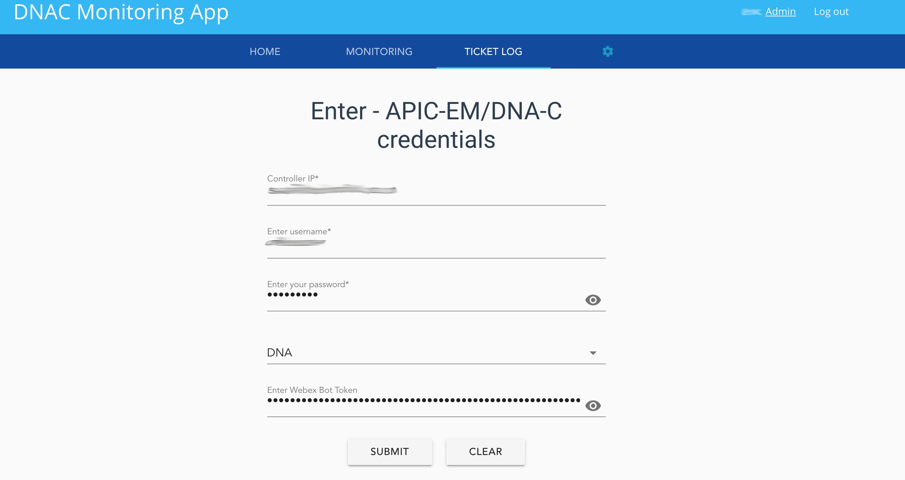
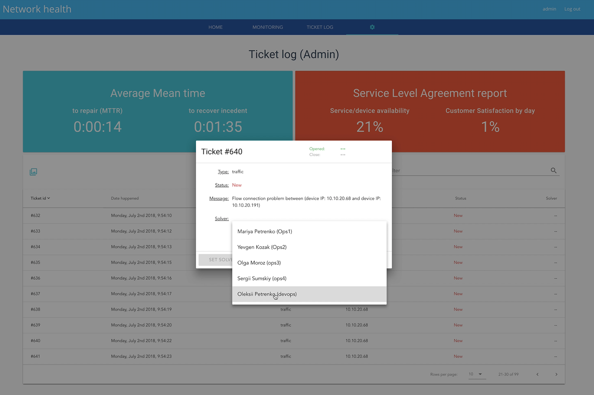

# DNAC Monitoring App

  - [About this App](#about_this_app)
  - [The main featuresg](#the_main_features)
  - [Install and run locally ](#install_and_run_locally )
  - [Test App using Cisco DevNet sandboxes](#test_app_using_cisco_devnet_sandboxes)

## About this App
DNAC Monitoring App extends the basic features of [DNA-C](https://www.cisco.com/c/en/us/products/cloud-systems-management/dna-center/index.html) (Cisco Digital Network Architecture Center). This App help collect information about devices and manage network issues. This App can be useful for Enterprise and Service Providers who want to collect and store different changes about network devices, calculate and manage different indicators such as:
- Average MTTR (Mean time to repair); 
- Average mean time to recover incident; 

## The main features
1. An application that can collect and process data from DNA-C
2. User-friendly interface 

3. You can add and manage different type of roles:
- IT management/CIO reports: gets health report and high-level SLA stats (you can manage or propose your parameters for SLA calculation)
- IT manager: gets opened/closed service requests (ticket) and MTTR stats. 
- Also can assign responsible persons from the Administrator/DevOps list for solving the ticket 
- Administrator/DevOps: can solve a ticket, get WAN availability and average latency reports 

4. Using Redis, Celery and local DataBase App collect and compare different device config changes

5. Ticket management:
- filters by type of problem: 
    - traffic
    - configuration change
- filters by creation date 
- filters by ticket status:
    - open 
    - in progress
    - rejected
    - solved
 
- Notifications module:
    - sending alerts via [Webex Teams](https://www.webex.com/team-collaboration.html)
    - Email 
- Collect and display inventory and topology from DNA-C 

## Install and run locally 

You need to install [Python 3+](https://realpython.com/installing-python/), [Vue.js](https://v1.vuejs.org/guide/installation.html)


In developer mode, open project in IDE/terminal

`git clone https://github.com/oborys/DNAC-Monitoring-App.git`

then run commands (also you can find)
```
python3 -m venv venv
source venv/bin/activate
pip install -r requirements.txt
./manage.py migrate
```

```
cd app/vueapp
npm i
npm run build
cd ../..
```

```
./manage.py collectstatic
./manage.py createsuperuser
```

Password must contain at least 8 characters

`./manage.py runserver`

First, you need to create User profile for created superuser:
go to http://localhost:8000/admin/
Click on User profiles --> Add user profile --> Select user (chose superuser name that you create before) --> Select role (Admin) --> Push Save


open new terminal tab and run the commands

install redis for mac: 

`brew install redis`

install redis for linux: 

`sudo apt-get install redis-server`

`redis-server`

open new terminal tab and run the commands

```
source venv/bin/activate
celery -A project worker -l info
```

open new terminal tab and run the commands

```
source venv/bin/activate
celery -A project beat -l info --scheduler django_celery_beat.schedulers:DatabaseScheduler
```

For correct using of notification module, you need to create your Bot
[Sign-up](https://www.webex.com/pricing/free-trial.html) and [Sign-in](https://teams.webex.com/signin) in Webex Teams
Go to [https://developer.webex.com/](https://developer.webex.com/), then click [My Apps](https://developer.webex.com/my-apps) and Create a New App (Bot)

Copy and save Bot's Access Token


Then add email credential (EMAIL_HOST, EMAIL_HOST_USER, EMAIL_HOST_PASSWORD, EMAIL_PORT) in project/settings.py
Uncomment send_mail function in file info_sender/email_sender.py
For example you can use [Gmail to send email](https://support.google.com/a/answer/176600?hl=en) from App

After deployment, you need to add a network controller (DNA-C) credentials (in case of local deployment http://localhost:8000/app/#/settings)



Ticket management  


Edit/modify front-end files:
- For edit information in static files go to static/templates (you can find three html file index.html, app.html, base.html)
- For edit vue files go to app/src/components


## Test App using Cisco DevNet sandboxes

Available [sandboxes by Networking category](https://devnetsandbox.cisco.com/RM/Topology?c=14ec7ccf-2988-474e-a135-1e90b9bc6caf)

In this direction, you can also use DNA-C (Digital Network Architecture Center) sandboxes

DNA-C 1.2.10 - [https://sandboxdnac2.cisco.com/](https://sandboxdnac2.cisco.com/)

login: devnetuser

password: Cisco123!

DNA-C 1.2.6 - [https://sandboxdnac.cisco.com](https://sandboxdnac.cisco.com)

login: devnetuser

password: Cisco123!


**Other Useful links**

- [Cisco DevNet Modules](https://developer.cisco.com/learning/modules)
- [Discover code repositories related to Cisco technologies](https://developer.cisco.com/codeexchange/)
- [Cisco Ecosystem Exchange](https://developer.cisco.com/ecosystem)
- [Cisco DevNet github](https://github.com/CiscoDevNet)
- [Sandbox Labs](https://devnetsandbox.cisco.com/RM/Topology)

